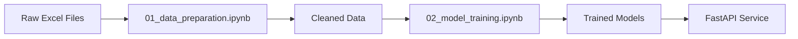

# 📓 Jupyter Notebooks - Room Recommendation Analysis

This folder contains Jupyter notebooks for data exploration and model development in the Room Recommendation System.

## 📚 Notebooks

### 1. [01_data_preparation.ipynb](01_data_preparation.ipynb)
**Data Cleaning and Preparation Pipeline**

This notebook demonstrates the complete data preparation process for room booking records from years 2557-2568.

**Key Features:**
- 📊 Reading and combining multiple Excel files from different years
- 🧹 Data cleaning and standardization
- 📅 Thai date conversion to standard datetime format
- ⏰ Duration calculation and event period classification
- 🏢 Room name normalization
- 💰 Adding price and seating capacity mappings
- 📁 Exporting cleaned data for model training

**Technologies Used:**
- `pandas` for data manipulation
- `numpy` for numerical operations
- `re` for text pattern matching
- `openpyxl` for Excel file handling

---

### 2. [02_model_training.ipynb](02_model_training.ipynb)
**Machine Learning Model Development and Evaluation**

This notebook explores different machine learning algorithms for room classification based on booking features.

**Key Features:**
- 🔍 Exploratory Data Analysis (EDA)
- 🎯 Feature selection and engineering
- 🤖 Model training with multiple algorithms:
  - Decision Tree Classifier
  - Support Vector Machine (SVM)
  - K-Nearest Neighbors (KNN)
- 📊 Model evaluation and comparison
- 📈 Visualization of results:
  - Accuracy comparisons
  - Classification reports
  - Decision boundaries (PCA 2D)
  - Decision tree visualization
- 💾 Model persistence with joblib

**Technologies Used:**
- `scikit-learn` for machine learning
- `matplotlib` & `seaborn` for visualization
- `joblib` for model serialization

## 🚀 How to Use

### Prerequisites
```bash
# Install required packages
pip install jupyter pandas numpy scikit-learn matplotlib seaborn openpyxl joblib
```

### Running the Notebooks

1. **Start Jupyter Lab/Notebook:**
```bash
jupyter lab
# or
jupyter notebook
```

2. **Execute notebooks in order:**
   - First run `01_data_preparation.ipynb` to prepare the data
   - Then run `02_model_training.ipynb` to train and evaluate models

### Directory Structure Expected
```
roomfastwork/
├── notebooks/
│   ├── 01_data_preparation.ipynb
│   ├── 02_model_training.ipynb
│   └── README.md (this file)
├── data/
│   ├── raw/           # Original Excel files
│   └── clean/         # Cleaned data files
└── code/
    └── models/        # Saved model files
```

## 📊 Data Flow



## 🎯 Model Performance Summary

| Model | Train Accuracy | Test Accuracy | Best For |
|-------|---------------|--------------|----------|
| Decision Tree | 98.9% | 98.4% | Production use (selected) |
| SVM (RBF) | 93.7% | 90.8% | Non-linear patterns |
| KNN (k=15) | 100% | 93.8% | Local patterns |

## 📝 Key Insights

1. **Data Quality**: The dataset spans 11 years (2557-2568) with over 3,600 booking records
2. **Room Distribution**: 12 unique meeting rooms with varying capacities (8-1,300 seats)
3. **Model Selection**: Decision Tree was chosen for production due to:
   - High accuracy (98.4% on test set)
   - Low overfitting (0.5% gap)
   - Interpretability
   - Fast inference time

## 🔬 For Developers

If you want to use the cleaned Python scripts instead of notebooks:

```python
# Data preparation
from src.data_preparation import RoomDataProcessor

processor = RoomDataProcessor()
all_data = processor.process_all_files()

# Model training
from src.models import RoomClassificationModels

trainer = RoomClassificationModels()
df = trainer.load_data()
trainer.prepare_data(df)
results = trainer.train_all_models()
```

## 📚 Additional Resources

- [Main README](../README.md) - Project overview
- [FastAPI Documentation](http://localhost:9000/docs) - API endpoints
- [Python Scripts](../src/) - Production-ready code

## 👨‍💻 Contributing

Feel free to experiment with:
- Different feature engineering techniques
- Additional ML algorithms (Random Forest, XGBoost, etc.)
- Hyperparameter tuning
- Cross-validation strategies
- Ensemble methods

## 📧 Contact

For questions or suggestions about these notebooks, please open an issue on GitHub.